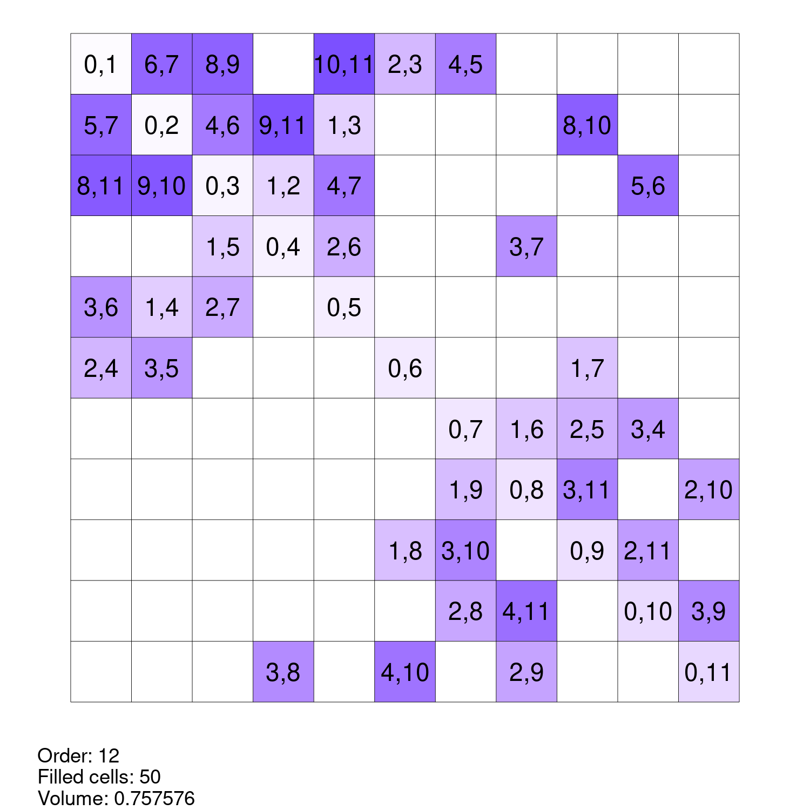

[](https://zenodo.org/badge/latestdoi/544776750)

# Generating Maximal Partial Room Squares in R

Two different greedy procedures for building maximal partial Room squares in R inspired by Meszka and Rosa (2021) using functions from the [wallis](https://mhenderson.r-universe.dev/wallis) R package.

Tested on R4.4.0 with renv 1.0.7, targets 1.7.1 and wallis 0.0.0.9006.

To create the plots below, first install `renv` and install package dependencies:
```
install.packages("renv")
renv::restore()
```

Now run the `targets` pipeline:
```
targets::tar_make()
```

## greedy1

See `R/greedy1.R`.


## greedy2

See `R/greedy2.R`.




# References

<div id="refs" class="references csl-bib-body hanging-indent">

<div id="ref-meszkaMaximalPartialRoom2021" class="csl-entry">

Meszka, Mariusz, and Alexander Rosa. 2021. “Maximal Partial Room Squares.” *Journal of Combinatorial Designs* 29 (7): 482–501. <https://doi.org/10.1002/jcd.21777>.

</div>

</div>
