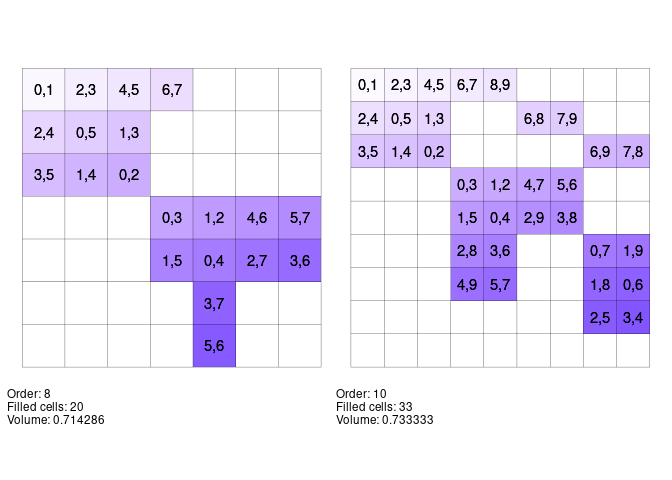
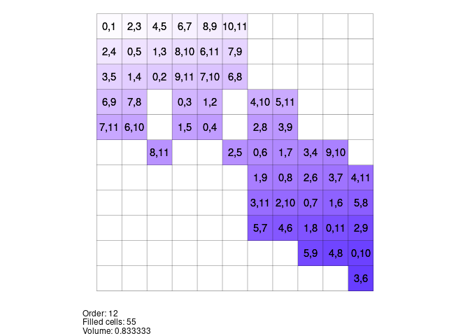
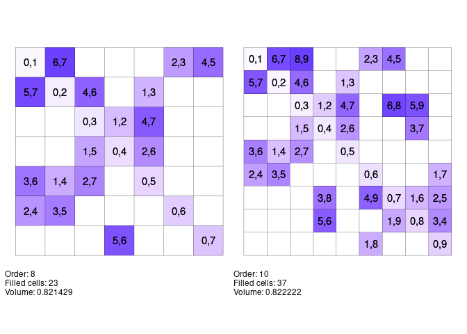
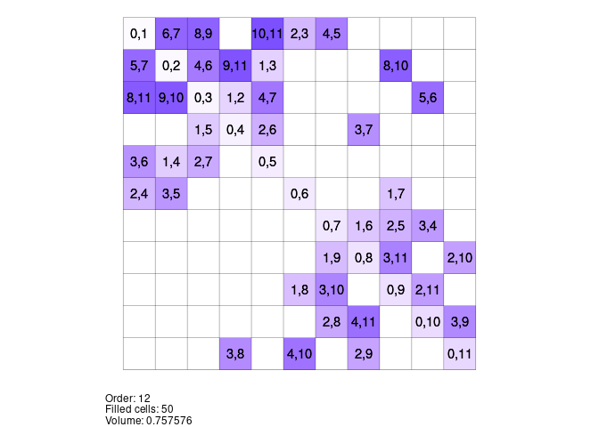

Generating Maximal Partial Room Squares in R
================
Matthew Henderson

-   [I: greedy1](#i-greedy1)
-   [II: greedy2](#ii-greedy2)
-   [References](#references)

<!-- README.md is generated from README.Rmd. Please edit that file -->

Two different greedy procedures for building maximal partial Room
squares in R inspired by Meszka and Rosa (2021).

# I: greedy1

`greedy1` visits all cells in order placing into the next cell the first
available pair such that the conditions of being a partial Room square
will not be violated.

``` r
R <- greedy1(6)
plot_room_square_labs(R)
```

<!-- -->

In this plot colour represents the order in which cells were filled. The
cells were filled in order from lightest to darkest.

``` r
# is R a maximal partial Room square?
is_maximal_proom(R)
#> [1] TRUE
```

## A few examples of maximal partial Room squares constructed with greedy1

<!-- -->

<!-- -->

# II: greedy2

`greedy2` iterates through all pairs in order placing the next pair in
the first available cell such that the conditions of being a partial
Room square are not violated.

``` r
R <- greedy2(8)
plot_room_square_labs(R)
```

<!-- -->

Again colour represents order of filling, proceeding from lightest to
darkest.

``` r
# is R a maximal partial Room square?
is_maximal_proom(R)
#> [1] TRUE
```

## A few examples of maximal partial Room squares constructed with greedy2



<!-- -->

# References

<div id="refs" class="references csl-bib-body hanging-indent">

<div id="ref-meszkaMaximalPartialRoom2021" class="csl-entry">

Meszka, Mariusz, and Alexander Rosa. 2021. “Maximal Partial Room
Squares.” *Journal of Combinatorial Designs* 29 (7): 482–501.
<https://doi.org/10.1002/jcd.21777>.

</div>

</div>
