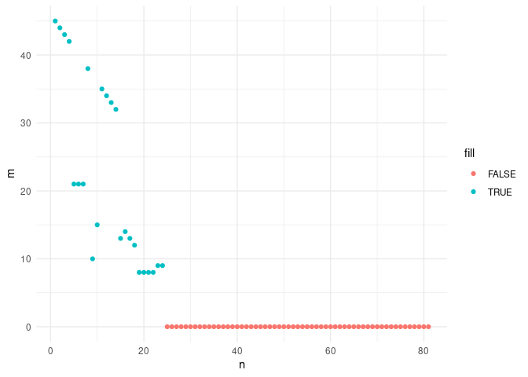
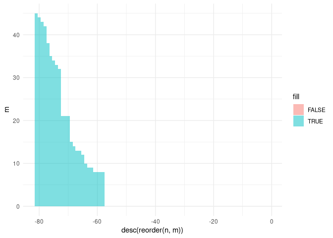
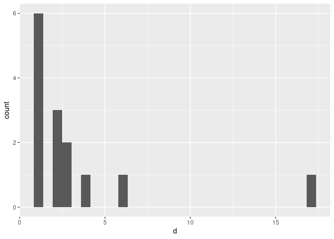

-   [maximal-room-squares](#maximal-room-squares)
    -   [I: greedy1](#i-greedy1)
    -   [II: greedy2](#ii-greedy2)
    -   [III: Calculate available pairs](#iii-calculate-available-pairs)
-   [References](#references)

<!-- README.md is generated from README.Rmd. Please edit that file -->

# maximal-room-squares

<!-- badges: start -->
<!-- badges: end -->

Below we implement two greedy procedures for building maximal partial
Room squares, inspired by Meszka and Rosa (2021)

## I: greedy1

In this section the greedy procedure involves visiting all cells in
order and placing the least available pair that does not violate the
conditions of being a partial Room square.

``` r
# the order of maximal partial Room square we are looking for
n <- 10

tic()
R <- expand_grid(row = 1:(n - 1), col = 1:(n - 1)) %>%
  mutate(first = as.integer(NA), second = as.integer(NA)) %>%
  mutate(avail = list(0:(n - 1))) %>%
  greedy1()
toc()
#> 0.279 sec elapsed
```

``` r
# is R a maximal partial Room square?
is_maximal_proom(R)
#> [1] TRUE
```

<!-- -->

## II: greedy2

In this section we consider a greedy procedure that considers the pairs
first and places the next pair in the first available cell that does not
violate the conditions of being a partial Room square.

``` r
n <- 10

tic()
# iterate through pairs in given order
R <- expand_grid(row = 1:(n - 1), col = 1:(n - 1)) %>%
  mutate(first = as.integer(NA), second = as.integer(NA)) %>%
  mutate(avail = list(0:(n - 1))) %>%
  greedy2()
toc()
#> 0.335 sec elapsed
```

``` r
# is R a maximal partial Room square?
is_maximal_proom(R)
#> [1] TRUE
```

<!-- -->

## III: Calculate available pairs

In this section we process cells in order but when we are considering
which pairs to place in the current cell we only consider those pairs
that are available for the current cell. We calculate the available
pairs as the intersection Pe of P (the set of all pairs so for not used)
and A (the set of combinations of size 2 from elements not already used
either in the current column or the current row).

One benefit of this approach is that we can study the sets Pe. Below,
for example, we track the sets Pe as the algorithm runs so that
afterwards we can inspect those sets.

``` r
P <- list(c(1, 2), c(1, 3), c(1, 4), c(1, 5), c(2, 3), c(2, 4), c(2, 6), c(3, 4), c(3, 7), c(5, 6), c(5, 7), c(5, 8), c(5, 9), c(5, 10), c(6, 7), c(6, 8), c(6, 9), c(6, 10), c(7, 8), c(7, 9), c(7, 10), c(8, 9), c(8, 10), c(9, 10), c(1, 6), c(1, 7), c(1, 8), c(1, 9), c(1, 10), c(2, 5), c(2, 7), c(2, 8), c(2, 9), c(2, 10), c(3, 5), c(3, 6), c(3, 8), c(3, 9), c(3, 10), c(4, 5), c(4, 6), c(4, 7), c(4, 8), c(4, 9), c(4, 10))
# 
E <- list(c(1, 1), c(2, 2), c(3, 3), c(4, 4), c(3, 4), c(4, 2), c(2, 3), c(5, 5), c(4, 3), c(1, 2), c(6, 6), c(7, 7), c(8, 8), c(9, 9), c(7, 8), c(9, 6), c(6, 9), c(8, 7), c(8, 9), c(9, 7), c(1, 4), c(2, 1), c(6, 8), c(7, 6), c(1, 3), c(1, 5), c(1, 6), c(1, 7), c(1, 8), c(1, 9), c(2, 4), c(2, 5), c(2, 6), c(2, 7), c(2, 8), c(2, 9), c(3, 1), c(3, 2), c(3, 5), c(3, 6), c(3, 7), c(3, 8), c(3, 9), c(4, 1), c(4, 5), c(4, 6), c(4, 7), c(4, 8), c(4, 9), c(5, 1), c(5, 2), c(5, 3), c(5, 4), c(5, 6), c(5, 7), c(5, 8), c(5, 9), c(6, 1), c(6, 2), c(6, 3), c(6, 4), c(6, 5), c(6, 7), c(7, 1), c(7, 2), c(7, 3), c(7, 4), c(7, 5), c(7, 9), c(8, 1), c(8, 2), c(8, 3), c(8, 4), c(8, 5), c(8, 6), c(9, 1), c(9, 2), c(9, 3), c(9, 4), c(9, 5), c(9, 8))
```

``` r
n <- 10

tic()
# iterate through empty cells in given order
R <- expand_grid(row = 1:(n - 1), col = 1:(n - 1)) %>%
  mutate(first = as.numeric(NA), second = as.numeric(NA)) %>%
  mutate(avail = list(1:n))

RX <- greedy3(R)

R <- RX[[1]]
X <- RX[[2]]

toc()
#> 0.426 sec elapsed
```

``` r
# is R a maximal partial Room square?
is_maximal_proom(R)
#> [1] TRUE
```

<!-- -->

``` r
ggplot(data = X %>% pivot_wider(), aes(col, row)) +
  geom_tile(aes(fill = branch)) +
  geom_segment(data = grid_lines(n-1, n-1), aes(x = x, y = y, xend = xend, yend = yend), size = .1) +
 # geom_text(data = X %>% pivot_wider() %>% filter(!is.na(first)), aes(label = paste(first, second, sep = ","))) +
  scale_y_reverse() +
  coord_fixed() + 
  theme_void() +
  theme(
    legend.position = "bottom",
    legend.title = element_blank()
  )
```

<!-- -->

Here is a plot of the sizes of the sets Ep as the algorithm runs.

<!-- -->

The filled cells are coloured blue and the red dots represent empty
cells. As the resulting square is maximal we end up with a run of empty
cells at the end and the volume of the partial Room square is the number
of blue dots.

Are these plots worth investigating? Can they tell us anything about the
possible volumes of partial Room squares?

There’s nothing to prevent us from ordering the points in descending
order. Or turning the points into columns.

<!-- -->

In this plot the sum of the differences in height equals 45.

At first I wondered if a proof might be possible based on the slope of
this curve. Are there some constraints that prevent this curve from
being steep enough to reach the bottom before 24 (the least volume for a
maximal partial Room square of order 10).

For example, the first drop in this plot has size 17 and it’s easy to
see why. In the first cell all pairs are available and so the first
point is at 45. In the next cell we have to remove all 17 other pairs
involving one or other of the two symbols in the first pair because the
current cell either lies in the same row or column.

Now is it interesting to note that we never have another drop of that
height again. Is that always true? In fact the next biggest drop looks
like it’s about half the height of the first one. It seems like maybe
there are some constraints on these heights that would prevent us
reaching 0 too quickly but it’s quite hard to understand what is going
on in general.

Also, I wonder if it’s valid to do what I’ve done with this plot. The
first plot really corresponds to a sequence of partial Room squares that
arise from the greedy procedure. But this plot doesn’t have the same
connection. It’s just a reordering of the first plot. Is that a problem?

Another observation is that in this example we are moving along rows and
rows will inevitably have at least four empty cells. So the red dots we
see on the x-axis in little groups of four or five correspond to rows.
In fact, in this case we end up with an empty last row which are the
eight red dots on the x-axis at the end.

To have positive volume requires that there are gaps in those red dots.
The volume can only happen between gaps. Does that help? Do the gaps and
the drop heights conspire together to limit the total volume. Actually,
what we are interested in is low volume. We want to show that a certain
minimum volume is required.

``` r
X <- X %>%
  arrange(desc(m)) %>%
  mutate(
    dm = lag(m),
    d = dm - m
  )
```

Plot the differences.

``` r
ggplot(X, aes(x = 1:81, y = d)) +
  geom_col(width = 1, alpha = .5)
```

Plot a histogram of the non-zero differences.

``` r
ggplot(X %>% filter(d != 0), aes(d)) +
  geom_histogram()
#> `stat_bin()` using `bins = 30`. Pick better value with `binwidth`.
```

<!-- -->

Sum these differences with their weights gives the total number of
unordered pairs.

``` r
11*1 + 1*2 + 1*3 + 1*4 + 1*6 + 1*8 + 1*11
#> [1] 45
```

Is there some symmetry going on here?

What does 11 + 1 + 1 + 1 + 1 + 1 + 1 = 17 correspond to?

What does 1 + 2 + 3 + 4 + 6 + 8 + 11 = 35 correspond to?

Where is the 24? It’s the number of columns in the plot.

Is it possible to find 23 columns whose differences when arranged in
order sum to 45? Of course. Surely.

# References

<div id="refs" class="references csl-bib-body hanging-indent">

<div id="ref-meszkaMaximalPartialRoom2021" class="csl-entry">

Meszka, Mariusz, and Alexander Rosa. 2021. “Maximal Partial Room
Squares.” *Journal of Combinatorial Designs* 29 (7): 482–501.
<https://doi.org/10.1002/jcd.21777>.

</div>

</div>
