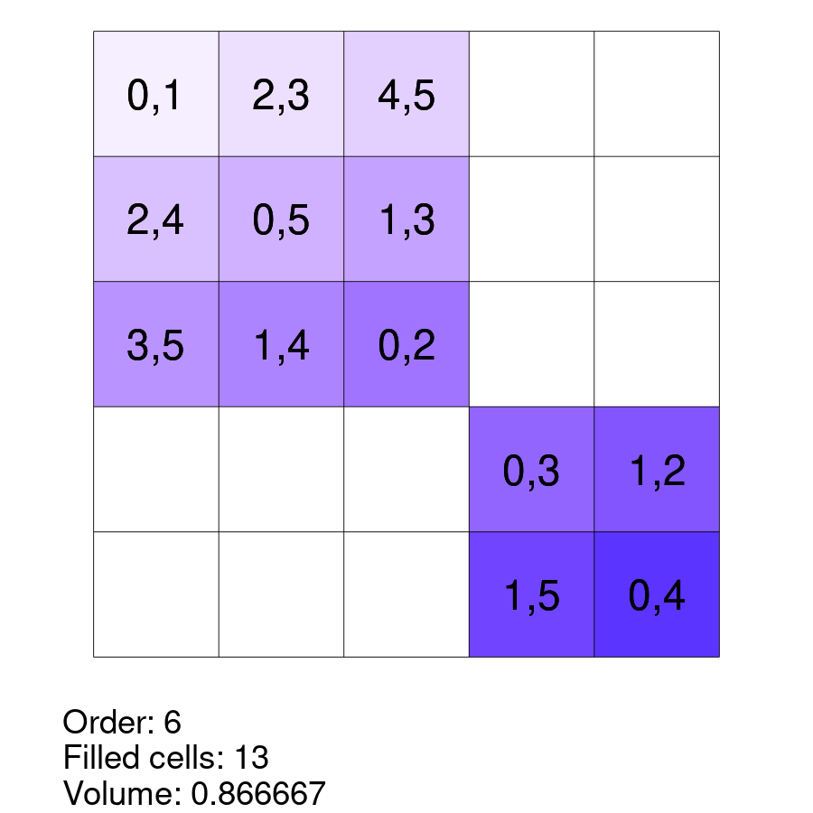
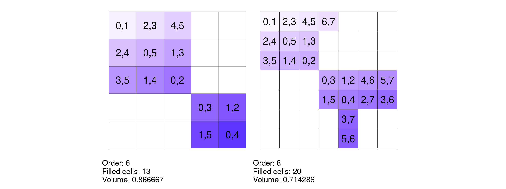
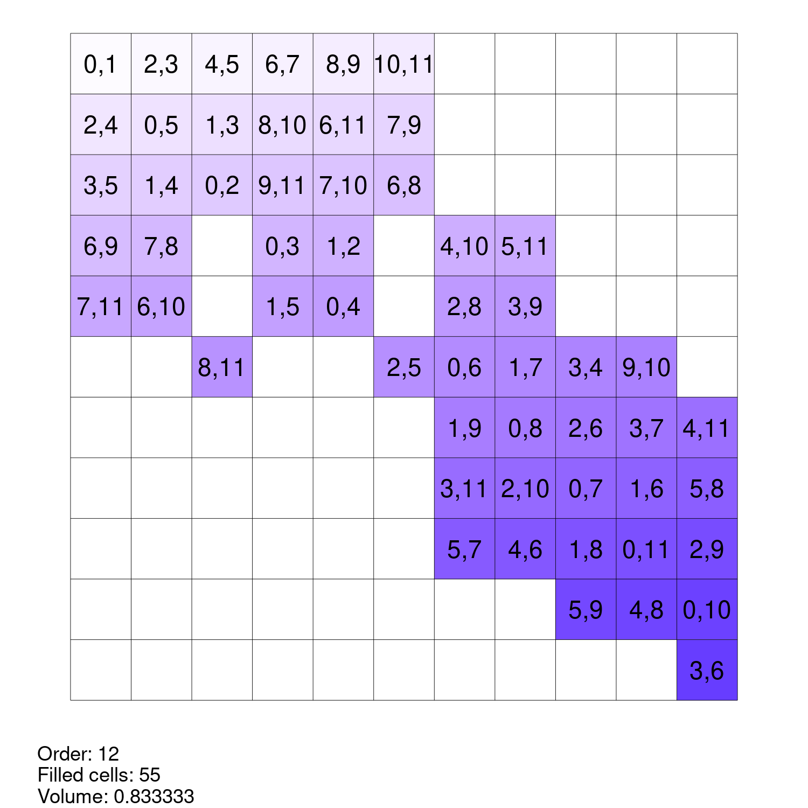
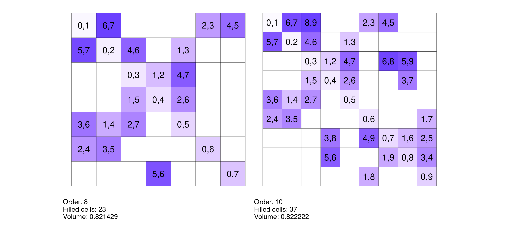

# Generating Maximal Partial Room Squares in R

Two different greedy procedures for building maximal partial Room squares in R inspired by Meszka and Rosa (2021).

# greedy1

# greedy2

# References

Meszka, Mariusz, and Alexander Rosa. 2021. “Maximal Partial Room Squares.” *Journal of Combinatorial Designs* 29 (7): 482–501. <https://doi.org/10.1002/jcd.21777>.

