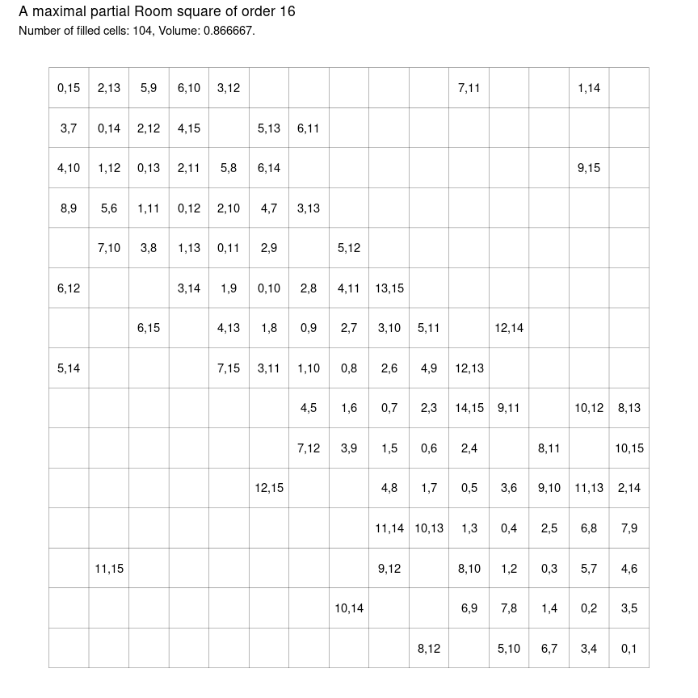

<!-- README.md is generated from README.Rmd. Please edit that file -->

# maximal-room-squares

<!-- badges: start -->
<!-- badges: end -->

``` r
library(dplyr)
library(tictoc)

# the order of Room square we are looking for
n <- 10

# a data frame representing an empty Room square
# of the desired order
# q. is the pivot_longer really needed?
R <- expand_grid(row = 1:(n - 1), col = 1:(n - 1)) %>%
  mutate(first = as.integer(NA), second = as.integer(NA)) %>%
  mutate(avail = list(0:(n - 1))) %>%
  pivot_longer(first:second)

# pairs to be used in order
P <- not_used_pairs(R)
P <- P[order(sapply(P, diff), decreasing = TRUE)]

# empty cells to be visited in order
E <- empty_cells(R)
E <- E[order(sapply(sapply(E, diff), abs), decreasing = TRUE)]
```

``` r
tic()
# iterate through empty cells in given order
for(e in E) {
  
  # these symbols are available
  available <- R[R$row == e[1] & R$col == e[2], "avail"]$avail[[1]]

  # iterate through un-used pairs in given order
  # shouldn't we only be looking at pairs from available?
  # i.e. the intersection of P and subsets of size 2 from available
  # then we don't even need to iterate, we simply choose the
  # first element of that subset, if it's non-empty
  for(p in P) {
    
    # if empty cell e is suitable for pair p
    # then:
    # assign p to cell e,
    # remove cell e from the list of empty cells
    # remove cell p from the list of pairs
    # remove both elements of p from lists of symbols missing in row e[1]
    # remove both elements of p from lists of symbols missing in col e[2]
    # and stop
    if(p[1] %in% available && p[2] %in% available) {

      # assign p to cell e,
      R[R$row == e[1] & R$col == e[2], "value"] <- p

      # remove cell e from the list of empty cells
      E <- E[-match(list(e), E)]
      # remove cell p from the list of pairs
      P <- P[-match(list(p), P)]

      # remove both elements of p from lists of available symbols in row e[1]
      R[R$row == e[1], "avail"]$avail <- lapply(R[R$row == e[1], "avail"]$avail, remove_both, p)
      # remove both elements of p from lists of available symbols in col e[2]
      R[R$col == e[2], "avail"]$avail <- lapply(R[R$col == e[2], "avail"]$avail, remove_both, p)

      break()
    }
    
  }
  
}
toc()
#> 0.142 sec elapsed
```

``` r
# is R a maximal partial Room square?
is_maximal_proom(R)
#> [1] TRUE
```

<!-- -->
