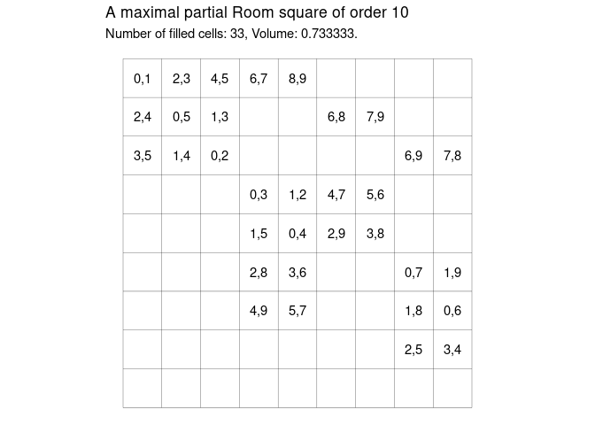
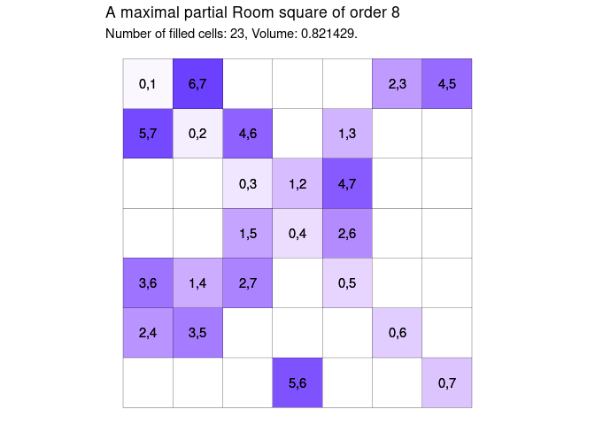

Generating Maximal Partial Room Squares in R
================
Matthew Henderson

-   [I: greedy1](#i-greedy1)
-   [II: greedy2](#ii-greedy2)
-   [Results](#results)
-   [References](#references)

<!-- README.md is generated from README.Rmd. Please edit that file -->

Two different greedy procedures for building maximal partial Room
squares in R inspired by Meszka and Rosa (2021).

# I: greedy1

`greedy1` visits all cells in order placing into the next cell the first
available pair not violating the conditions of being a partial Room
square.

``` r
library(tictoc)

n <- 10

tic()
R <- greedy1(n)
toc()
#> 0.075 sec elapsed
```

<!-- -->

``` r
# is R a maximal partial Room square?
is_maximal_proom(R)
#> [1] TRUE
```

# II: greedy2

`greedy2` iterates through all pairs in order placing the next pair in
the first available cell not violating the conditions of being a partial
Room square.

``` r
n <- 10

tic()
R <- greedy2(n)
toc()
#> 0.188 sec elapsed
```

<!-- -->

``` r
# is R a maximal partial Room square?
is_maximal_proom(R)
#> [1] TRUE
```

# Results

``` r
targets::tar_read(results)
#> # A tibble: 190 × 5
#>        n name    value             n_filled_cells volume
#>    <int> <chr>   <list>                     <dbl>  <dbl>
#>  1     1 greedy1 <tibble [4 × 4]>               0  0    
#>  2     1 greedy2 <tibble [4 × 4]>               0  0    
#>  3     2 greedy1 <tibble [1 × 4]>               1  1    
#>  4     2 greedy2 <tibble [1 × 4]>               1  1    
#>  5     3 greedy1 <tibble [4 × 4]>               2  0.667
#>  6     3 greedy2 <tibble [4 × 4]>               2  0.667
#>  7     4 greedy1 <tibble [9 × 4]>               4  0.667
#>  8     4 greedy2 <tibble [9 × 4]>               3  0.5  
#>  9     5 greedy1 <tibble [16 × 4]>              7  0.7  
#> 10     5 greedy2 <tibble [16 × 4]>              7  0.7  
#> # ℹ 180 more rows
```

# References

<div id="refs" class="references csl-bib-body hanging-indent">

<div id="ref-meszkaMaximalPartialRoom2021" class="csl-entry">

Meszka, Mariusz, and Alexander Rosa. 2021. “Maximal Partial Room
Squares.” *Journal of Combinatorial Designs* 29 (7): 482–501.
<https://doi.org/10.1002/jcd.21777>.

</div>

</div>
