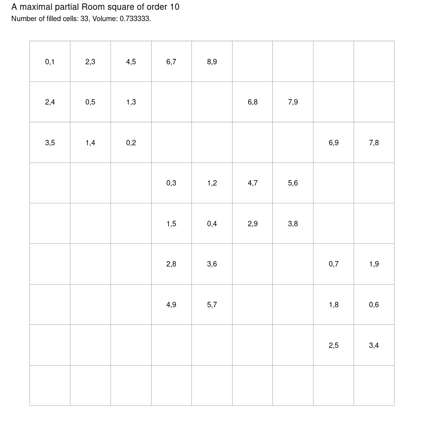
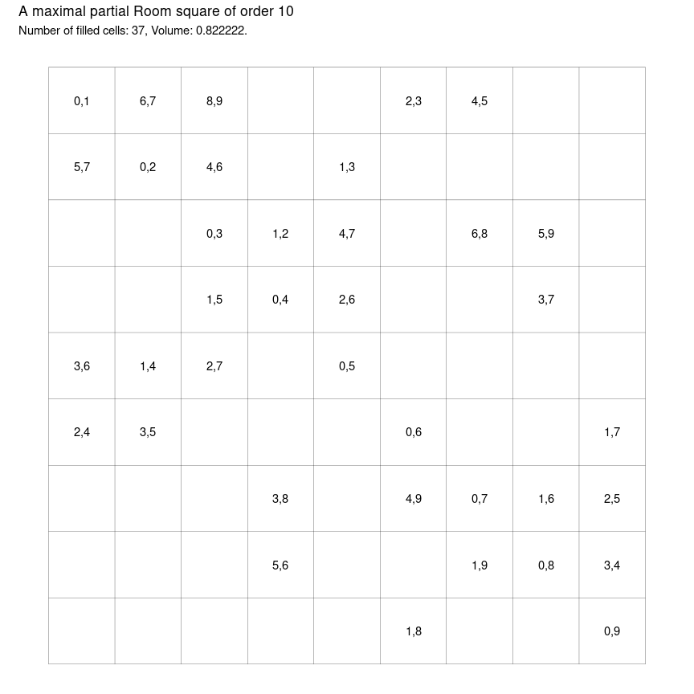
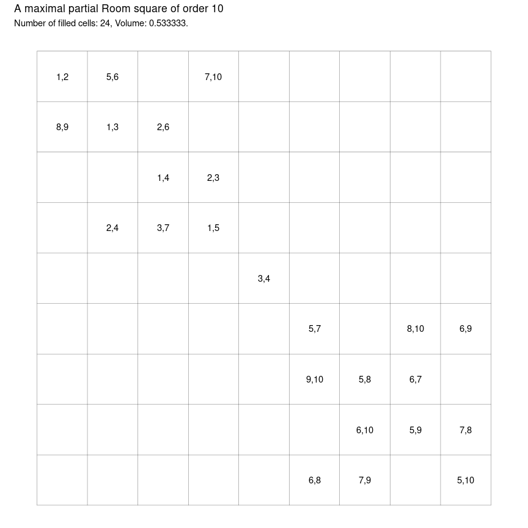
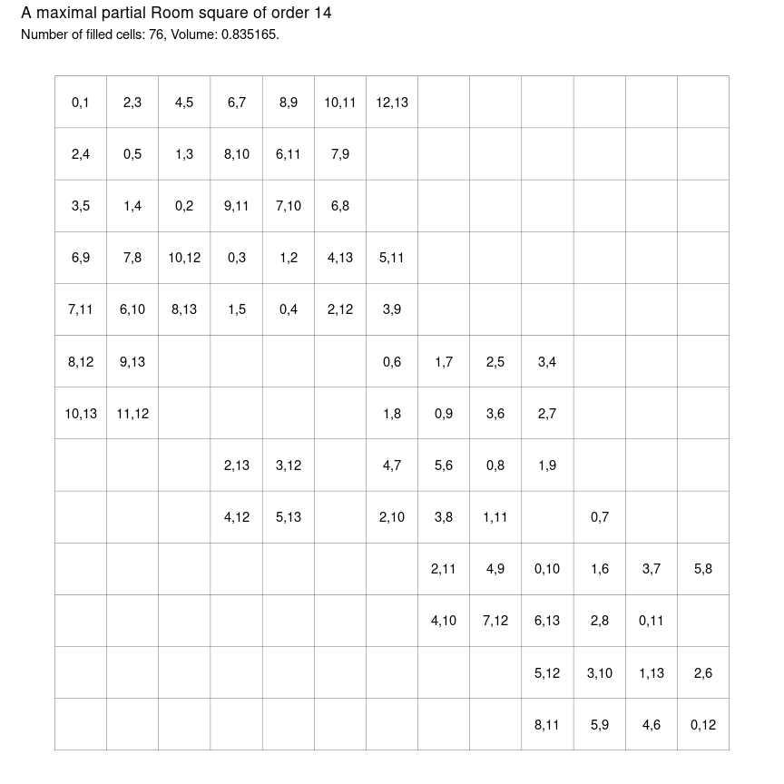

-   [Generating Maximal Partial Room Squares in
    R](#generating-maximal-partial-room-squares-in-r)
    -   [I: greedy1](#i-greedy1)
    -   [II: greedy2](#ii-greedy2)
    -   [III: greedy3: Calculate available
        pairs](#iii-greedy3-calculate-available-pairs)
    -   [IV: greedy4: Track available
        pairs](#iv-greedy4-track-available-pairs)
-   [References](#references)

<!-- README.md is generated from README.Rmd. Please edit that file -->

Four different greedy procedures for building maximal partial Room
squares, inspired by Meszka and Rosa (2021)

# Generating Maximal Partial Room Squares in R

## I: greedy1

In this section the greedy procedure involves visiting all cells in
order and placing the least available pair that does not violate the
conditions of being a partial Room square.

``` r
# the order of maximal partial Room square we are looking for
n <- 10

tic()
R <- expand_grid(row = 1:(n - 1), col = 1:(n - 1)) %>%
  mutate(first = as.integer(NA), second = as.integer(NA)) %>%
  mutate(avail = list(0:(n - 1))) %>%
  greedy1()
toc()
#> 0.355 sec elapsed
```

``` r
# is R a maximal partial Room square?
is_maximal_proom(R)
#> [1] TRUE
```

<!-- -->

## II: greedy2

In this section we consider a greedy procedure that considers the pairs
first and places the next pair in the first available cell that does not
violate the conditions of being a partial Room square.

``` r
n <- 10

tic()
# iterate through pairs in given order
R <- expand_grid(row = 1:(n - 1), col = 1:(n - 1)) %>%
  mutate(first = as.integer(NA), second = as.integer(NA)) %>%
  mutate(avail = list(0:(n - 1))) %>%
  greedy2()
toc()
#> 0.441 sec elapsed
```

``` r
# is R a maximal partial Room square?
is_maximal_proom(R)
#> [1] TRUE
```

<!-- -->

## III: greedy3: Calculate available pairs

In this section we process cells in order but when we are considering
which pairs to place in the current cell we only consider those pairs
that are available for the current cell. We calculate the available
pairs as the intersection Pe of P (the set of all pairs so for not used)
and A (the set of combinations of size 2 from elements not already used
either in the current column or the current row).

One benefit of this approach is that we can study the sets Pe. Below,
for example, we track the sets Pe as the algorithm runs so that
afterwards we can inspect those sets.

``` r
n <- 10

tic()
R <- expand_grid(row = 1:(n - 1), col = 1:(n - 1)) %>%
  mutate(first = as.numeric(NA), second = as.numeric(NA)) %>%
  mutate(avail = list(1:n)) %>%
  greedy3()
toc()
#> 0.285 sec elapsed
```

``` r
# is R a maximal partial Room square?
is_maximal_proom(R)
#> [1] TRUE
```

<!-- -->

## IV: greedy4: Track available pairs

In this section we keep track at every step of which pairs are available
for which empty cells. This means that every time a new cell is filled
we update all of the cells in the same row or same column by removing
any pairs that share an element in common with the most recently
assigned pair. We also update every remaining cell by removing the pair
that was most recently assigned.

This is the slowest approach but possibly the most interesting. Can we
learn anything by looking at those lists of available pairs as the
algorithm runs?

``` r
n <- 10

tic()
R <- expand_grid(row = 1:(n - 1), col = 1:(n - 1)) %>%
  mutate(first = as.numeric(NA), second = as.numeric(NA)) %>%
  mutate(Pe = list(combn(as.numeric(0:(n - 1)), 2, simplify = FALSE))) %>%
  greedy4()
toc()
#> 0.942 sec elapsed
```

``` r
# is R a maximal partial Room square?
is_maximal_proom(R)
#> [1] TRUE
```

<!-- -->

# References

<div id="refs" class="references csl-bib-body hanging-indent">

<div id="ref-meszkaMaximalPartialRoom2021" class="csl-entry">

Meszka, Mariusz, and Alexander Rosa. 2021. “Maximal Partial Room
Squares.” *Journal of Combinatorial Designs* 29 (7): 482–501.
<https://doi.org/10.1002/jcd.21777>.

</div>

</div>
